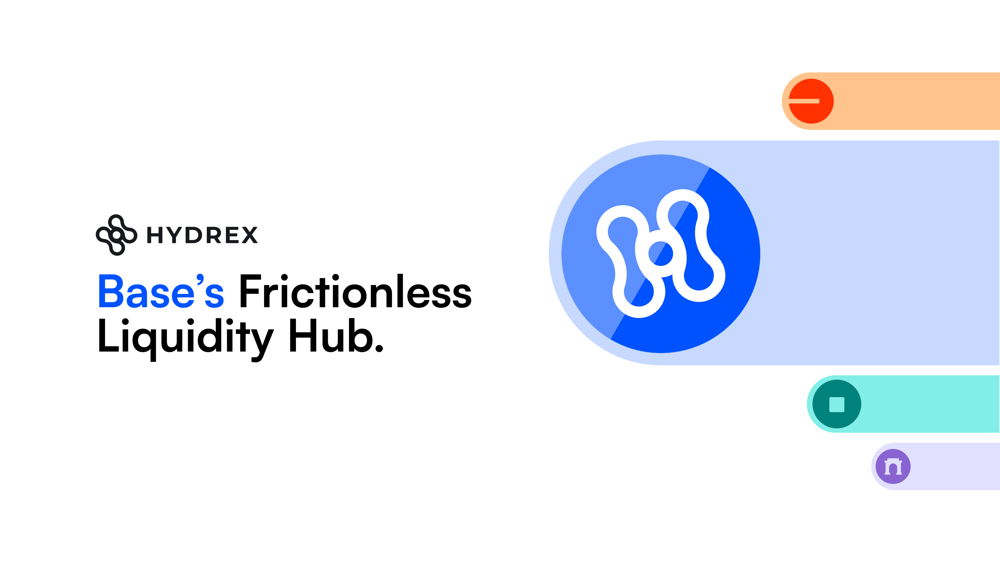

# 💧 Hydrex Periphery Contracts

This is a foundry repository containing the auxillary contracts for Hydrex.

## 🔑 Key Sections

- `token` - The official Hydrex token
- `basedrop` - All contracts related to the Basedrop campaign, like badges & protocol mining.
- `conduits` - Manager and delegate contracts to automate components of Hydrex.
- `partner-escrow` - veHYDX escrow contracts.

## 🚗 Getting Started

1. Run `npm i`.
2. Copy `.env.example` as `.env`.
3. Run `forge install foundry-rs/forge-std`

## 🤝 Commands

- `forge test` run Foundry tests
- `forge build` compile Foundry contracts
- See `package.json` for others
